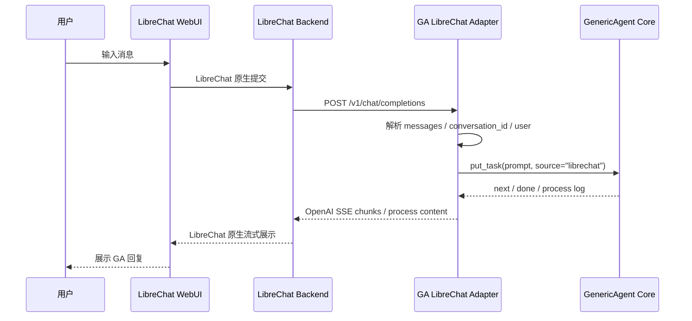

# GA 集成 LibreChat 接口适配方案与规划

> 日期：2026-04-29
> 目标项目：`E:\zfengl-ai-project\GenericAgent`
> 对接项目：`E:\zfengl-ai-project\LibreChat`
> 策略：GA 侧新增独立 API 适配层，LibreChat 侧使用现有 custom endpoint 能力接入，不对两边项目做侵入式重构。

## 1. 背景与目标

当前目标是把 GA 作为真正的 Agent 后端，接入 LibreChat 这个成熟 WebUI，让 LibreChat 成为 GA 的主要对话入口。核心原则不是把 GA 的内部逻辑搬进 LibreChat，也不是重写 LibreChat 的聊天链路，而是在 GA 项目内包装一层 OpenAI-compatible API，让 LibreChat 把 GA 当成一个自定义模型服务调用。

最终达到的效果：

- LibreChat 用户在前端选择 `GenericAgent` 后，可以直接和 GA 对话。
- LibreChat 继续负责登录、会话列表、消息展示、前端流式体验、消息持久化。
- GA 继续负责 Agent 执行、工具调用、任务循环、模型后端选择。
- 两边通过稳定 HTTP API 通信，后续 WebUI、CLI、其他聊天入口都可以复用同一层 GA API。

## 2. 集成边界

### 2.1 不改造的部分

- 不改 LibreChat 前端聊天组件。
- 不重写 LibreChat 后端的 `/api/agents/chat`、SSE、消息树、数据库逻辑。
- 不把 GA 的 AgentLoop、tool handler、LLM backend 迁移进 LibreChat。
- 不改外部依赖项目代码。

### 2.2 新增的部分

在 GA 项目内新增一个独立模块，并放在 `frontends` 下的独立文件夹中，建议命名为：

```text
frontends/librechat_adapter/
```

职责：

- 暴露 OpenAI-compatible HTTP API。
- 把 LibreChat 请求转换成 GA `put_task(...)`。
- 把 GA 当前 `next/done` 流式输出转换成 OpenAI SSE chunk。
- 把 GA 可能输出的“累积完整快照”转换成 LibreChat 需要的增量 delta，避免前端重复刷出整段文本。
- 把 GA 的思考摘要、执行进度、工具调用过程转换成 LibreChat 可展示的内容。
- 从请求体和自定义 headers 中提取 LibreChat 会话、父消息、用户元数据，并维护其与 GA 会话运行时的映射。
- 包装 GA 现有会话恢复能力，提供会话查询和读取接口，避免 LibreChat 接入后丢掉 GA 原本的历史会话管理能力。
- 管理请求中断、错误格式、模型列表、健康检查。

## 3. 当前项目现状

### 3.1 LibreChat 侧

LibreChat 不是单纯前端，而是包含 `client`、`api`、`packages/api`、`packages/data-provider` 的 monorepo。它已经支持 custom endpoint，配置项包含：

- `name`
- `apiKey`
- `baseURL`
- `models.default`
- `models.fetch`
- `dropParams`
- `titleConvo`
- `modelDisplayLabel`

因此接入 GA 的最低侵入路径是配置一个 custom endpoint，让 LibreChat 通过 OpenAI Chat Completions 协议访问 GA。

### 3.2 GA 侧

GA 当前已有自己的 WebUI 服务：

- `GET /api/state`
- `POST /api/chat`
- `GET /api/chat/:task_id/stream`
- `POST /api/abort`
- `POST /api/llm`
- `POST /api/new`
- `POST /api/continue`

但这些接口是 GA WebUI 专用协议，不是 OpenAI-compatible 协议。主要差异：

- 请求只接收 `{ "prompt": "..." }`，没有 `messages`、`model`、`stream` 等通用字段。
- 流式事件是 `next`、`done`、`heartbeat`、`app_error`。
- GA 使用全局 `history`、全局 `task_queue`、全局 `abort()`，天然更接近单用户单会话。
- LibreChat 需要稳定的多会话、多消息树、多用户边界。

## 4. 推荐架构



这个结构把协议适配限定在 GA 新模块里。LibreChat 不需要知道 GA 内部队列，GA 核心也不需要知道 LibreChat 前端状态。

## 5. GA 需要提供的 API 契约

### 5.1 健康检查

```http
GET /health
```

响应：

```json
{
  "ok": true,
  "service": "generic-agent-librechat-adapter",
  "version": "0.1.0",
  "configured": true,
  "running": false,
  "current_model": "OpenAIClient/gpt-5.4"
}
```

用途：

- 本地启动验证。
- LibreChat 接入前手动检查。
- 后续可以给 Windows 启动脚本或监控脚本使用。

### 5.2 模型列表

```http
GET /v1/models
```

响应：

```json
{
  "object": "list",
  "data": [
    {
      "id": "generic-agent",
      "object": "model",
      "created": 1777392000,
      "owned_by": "generic-agent"
    }
  ]
}
```

第一阶段可以在 LibreChat 里配置 `models.fetch: false`，即使 `/v1/models` 暂时只返回固定模型也能跑通。

### 5.3 Chat Completions

```http
POST /v1/chat/completions
Content-Type: application/json
Authorization: Bearer <GA_API_KEY>
```

请求示例：

```json
{
  "model": "generic-agent",
  "messages": [
    { "role": "system", "content": "You are GenericAgent." },
    { "role": "user", "content": "帮我分析这个问题" }
  ],
  "stream": true,
  "user": "librechat-user-id",
  "conversation_id": "librechat-conversation-id",
  "parent_message_id": "librechat-parent-message-id"
}
```

非流式响应：

```json
{
  "id": "chatcmpl-ga-...",
  "object": "chat.completion",
  "created": 1777392000,
  "model": "generic-agent",
  "choices": [
    {
      "index": 0,
      "message": {
        "role": "assistant",
        "content": "GA 的完整回复"
      },
      "finish_reason": "stop"
    }
  ]
}
```

流式响应：

```text
data: {"id":"chatcmpl-ga-...","object":"chat.completion.chunk","created":1777392000,"model":"generic-agent","choices":[{"index":0,"delta":{"role":"assistant"},"finish_reason":null}]}

data: {"id":"chatcmpl-ga-...","object":"chat.completion.chunk","created":1777392000,"model":"generic-agent","choices":[{"index":0,"delta":{"content":"GA 增量文本"},"finish_reason":null}]}

data: {"id":"chatcmpl-ga-...","object":"chat.completion.chunk","created":1777392000,"model":"generic-agent","choices":[{"index":0,"delta":{},"finish_reason":"stop"}]}

data: [DONE]
```

#### 5.3.1 GA 累积快照到 OpenAI delta 的转换

GA 当前运行链路中，`next` 事件不一定天然是增量文本。尤其当 GA runtime 使用 `inc_out=False` 时，`next` 可能是“截至当前时刻的完整回复快照”，例如依次收到：

```text
hello
hello world
hello world
```

LibreChat 通过 OpenAI Chat Completions SSE 消费的是追加型 `delta.content`。因此 adapter 不能把每个 `next` 原样转发，否则前端会看到重复内容。第一阶段必须在中间层实现 `DeltaTracker`，把 GA 快照归一化成真正增量：

```text
DeltaTracker
- key: request_id 或 task_id
- last_full_text: 上一次已处理的 GA 完整快照
- emitted_chars: 已发送给 LibreChat 的字符位置

处理规则：
1. 如果 current_full_text 以 last_full_text 开头：
   delta = current_full_text[len(last_full_text):]
   只发送 delta。
2. 如果 current_full_text 与 last_full_text 完全相同：
   不发送新的 SSE content chunk，只保留 heartbeat 或继续等待。
3. 如果 current_full_text 比 last_full_text 更短：
   视为旧快照或回退快照，不发送重复内容，并记录 stream_snapshot_regressed。
4. 如果 current_full_text 与 last_full_text 前缀不一致：
   计算最长公共前缀；能提取可靠新增部分时只发送新增部分，不能可靠判断时终止本轮流式输出并返回 OpenAI 风格错误，避免把整段内容重复注入 LibreChat。
5. 收到 done 时：
   先用同一规则补齐最后一段未发送 delta，再发送 finish_reason=stop 和 data: [DONE]。
```

示例转换：

```text
GA next: ["hello", "hello world", "hello world"]
LC delta: ["hello", " world", ""]
```

这部分是第一阶段聊天体验的关键要求，不依赖修改 GA 核心。即使后续 GA adapter 可以通过配置让 GA 直接产出增量，`DeltaTracker` 仍保留为防重复保护层。

### 5.4 思考过程与工具调用过程

GA 与普通模型不同，用户需要看到的不只是最后答案，还包括 Agent 执行中该有的过程信息。这里的“思考过程”不应该是模型原始隐藏推理链，而应该是 GA 可公开展示、可审计的阶段性思考摘要、计划、观察结果和工具调用记录。

第一阶段采用不侵入 LibreChat 的降级适配：

- 将 GA 输出中的 `<summary>...</summary>`、`LLM Running (Turn N)` 等过程信息解析为结构化 `process_event`。
- 将工具调用开始、工具名、关键参数摘要、执行结果摘要转换成 Markdown 内容块。
- 这些内容块和最终回答一起通过 OpenAI SSE 的 `delta.content` 输出，保证 LibreChat 不改源码也能稳定显示。
- 对过长的工具参数、文件内容、命令输出做截断和摘要，避免刷屏或泄露本地敏感内容。

建议展示格式：

```markdown
### 思考过程

1. 识别任务目标：...
2. 检查相关文件：...
3. 形成执行判断：...

### 工具调用

- 工具：`read_file`
  - 目标：`frontends/webui_server.py`
  - 结果：读取成功，发现现有 SSE 事件为 `next/done`

### 最终回复

...
```

第二阶段再做增强适配：

- 如果 LibreChat custom endpoint 对 `delta.reasoning` 展示兼容稳定，可将思考摘要放入 `delta.reasoning`。
- 如果 LibreChat 对 OpenAI `tool_calls` 展示兼容稳定，可将 GA 工具调用映射为 `delta.tool_calls`。
- 如果兼容性不足，仍保留 Markdown 内容块作为默认路径。

适配层内部建议统一成中间事件模型：

```text
GAProcessEvent
- type: content_delta | reasoning_summary | tool_call_start | tool_call_result | final | error
- conversation_id
- task_id
- turn
- tool_name
- summary
- content_delta
- raw_ref
```

这样 GA 核心只需要继续产出当前输出，adapter 负责解析和格式转换；未来如果 LibreChat 支持更好的过程 UI，只需要替换输出渲染器，不需要改 GA 核心。

### 5.5 错误响应

所有错误统一成 OpenAI 风格：

```json
{
  "error": {
    "message": "agent_not_configured",
    "type": "ga_error",
    "code": "agent_not_configured"
  }
}
```

建议错误码：

- `unauthorized`
- `bad_request`
- `agent_not_configured`
- `empty_prompt`
- `model_not_found`
- `busy`
- `aborted`
- `internal_error`

### 5.6 LibreChat 会话元数据透传

GA 后续要做到“同一个 LibreChat 会话连续追问保留上下文、不同会话不串上下文”，adapter 必须拿到 LibreChat 的会话相关元数据。但 LibreChat custom endpoint 未必会默认把 `conversation_id`、`parent_message_id` 作为 OpenAI 请求体字段传给上游，所以方案里需要明确元数据透传设计。

adapter 的提取优先级：

1. 优先读取请求 JSON 中的显式字段：`conversation_id`、`parent_message_id`、`user`。
2. 如果请求体没有，则读取 LibreChat custom endpoint 配置注入的 headers：
   - `x-ga-librechat-conversation-id`
   - `x-ga-librechat-parent-message-id`
   - `x-ga-librechat-user-id`
3. 如果两者都没有：
   - 第一阶段单用户模式降级为 `local-single-user/default-conversation`，并在日志中记录 `metadata_missing`。
   - 第二阶段启用会话隔离前，必须完成 LibreChat placeholder 展开验证；没有稳定 `conversation_id` 时不启用多会话隔离。

建议的 LibreChat 配置片段：

```yaml
headers:
  x-ga-librechat-conversation-id: '{{LIBRECHAT_BODY_CONVERSATIONID}}'
  x-ga-librechat-parent-message-id: '{{LIBRECHAT_BODY_PARENTMESSAGEID}}'
  x-ga-librechat-user-id: '{{LIBRECHAT_USER_ID}}'
```

其中 `x-librechat-body-parentmessageid: '{{LIBRECHAT_BODY_PARENTMESSAGEID}}'` 这种写法已可在 LibreChat 示例配置中看到同类模式；`conversation_id` 和 `user_id` 的准确 placeholder 名称在实现前需要用一个 mock endpoint 或 adapter 请求日志验证实际展开结果。验证方式是让 LibreChat 发送一条消息到临时 HTTP 服务，打印完整请求体和 headers，确认字段值不是空字符串、不是原始模板字符串。

元数据归一化后的内部结构建议为：

```text
LibreChatRequestMeta
- conversation_id
- parent_message_id
- user_id
- request_id
- source: body | header | fallback
```

后续 `GAConversationManager` 只使用归一化后的 `LibreChatRequestMeta`，不直接依赖 LibreChat 原始字段名，避免后续 LibreChat 配置变化扩散到 GA core。

### 5.7 GA 会话查询与读取接口

GA 当前已有基于 `temp/model_responses` 的会话恢复能力，`frontends/continue_cmd.py` 中已经提供：

- `list_sessions(exclude_pid=...)`：按更新时间列出可恢复历史会话。
- `extract_ui_messages(path)`：把历史日志解析成 UI 可展示的 `{role, content}` 消息。
- `restore(agent, path)`：把历史会话恢复进 GA backend/history。
- `reset_conversation(agent, ...)`：清空当前上下文并快照当前日志。

LibreChat 接入后，这部分能力不应该丢掉。adapter 需要在 OpenAI-compatible API 之外，额外提供 GA 命名空间下的中间层接口。第一阶段先做只读接口，第二阶段再考虑有副作用的 restore/bind。

建议接口：

```http
GET /v1/ga/sessions?limit=20
Authorization: Bearer <GA_API_KEY>
```

响应：

```json
{
  "object": "list",
  "data": [
    {
      "id": "ga_sess_7f3a...",
      "updated_at": 1777392000,
      "relative_time": "3小时前",
      "rounds": 8,
      "preview": "上次讨论的需求摘要...",
      "native_history_available": true
    }
  ]
}
```

```http
GET /v1/ga/sessions/{session_id}
Authorization: Bearer <GA_API_KEY>
```

响应：

```json
{
  "id": "ga_sess_7f3a...",
  "object": "ga.session",
  "rounds": 8,
  "messages": [
    { "role": "user", "content": "上一轮用户问题" },
    { "role": "assistant", "content": "上一轮 GA 回复" }
  ],
  "source": "model_responses",
  "restorable": true
}
```

接口边界：

- `session_id` 是 adapter 生成的不透明 ID，不能把本地绝对路径直接暴露给外部。
- 读取结果默认使用 `extract_ui_messages(...)` 的 UI 消息格式，不暴露原始模型响应文件。
- assistant 内容需要复用 `strip_summary_blocks(...)` 或等价逻辑，避免把不适合前端直接展示的过程标签原样泄露。
- 完整 native history 只允许 adapter 内部用于恢复，不作为默认 HTTP 响应字段返回。
- 所有 `/v1/ga/*` 接口都必须校验 `GA_API_KEY`，并建议第一阶段只监听 `127.0.0.1`。

可选恢复接口放到第二阶段：

```http
POST /v1/ga/sessions/{session_id}/restore
Authorization: Bearer <GA_API_KEY>
```

用途：

- 手动把某个 GA 历史会话恢复进当前 GA runtime。
- 后续配合 LibreChat conversation 绑定，实现“LibreChat 会话 ID -> GA 原生历史会话”的自动恢复。

恢复接口是状态变更接口，第一阶段不作为 LibreChat custom endpoint 的必需能力，避免误触发导致当前上下文被覆盖。

## 6. 会话与并发策略

### 6.1 第一阶段：本地单用户可用

适用范围：

- 用户本机 LibreChat 作为 GA 主 WebUI。
- 同一时间只跑一个 GA 任务。
- 优先验证文本对话、流式输出、停止按钮、基础错误展示。

实现策略：

- adapter 内部持有一个 GA runtime。
- `conversation_id` 进入日志和任务记录，但暂不承诺真正并发隔离。
- 如果 GA 正在运行，新请求返回 `429 busy` 或排队策略中的一种。建议第一阶段返回 `429 busy`，行为更清晰。

### 6.2 第二阶段：按会话隔离

适用范围：

- LibreChat 多会话切换不会串上下文。
- 同一用户的不同 conversation 可以有独立 GA history。

实现策略：

- 引入 `GAConversationManager`。
- key 使用 `user + conversation_id`。
- 每个 key 持有独立的 GA agent 实例或独立历史快照。
- 会话长时间不活跃后释放，释放时间建议默认 2 小时。

### 6.3 第三阶段：多用户与任务中断

适用范围：

- 多个 LibreChat 用户共用一个 GA 服务。
- 停止按钮只停止当前用户当前会话的任务。

实现策略：

- `task_id`、`conversation_id`、`user` 三者绑定。
- adapter 维护任务表：`task_id -> queue / abort flag / user / conversation_id`。
- 如果 GA 核心仍只支持全局 `abort()`，adapter 需要限制同时只允许一个运行任务。
- 如果要支持真正并发，需要后续把 GA 核心中断能力从全局状态拆到任务级别。

### 6.4 adapter 状态持久化策略

决策：

- 第一阶段不引入 SQLite，先使用内存态 `LibreChatRequestMeta`、`DeltaTracker`、任务表，优先把聊天体验闭环做稳。
- 第二阶段引入 adapter 自有 SQLite 状态库，使用 Python 标准库 `sqlite3`，不新增外部依赖。
- LibreChat 仍然是前端会话、消息列表、用户数据的主持久化系统；GA adapter 的 SQLite 只保存对接运行所需的轻量状态和审计信息。

SQLite 建议文件：

```text
temp/librechat_adapter/state.sqlite3
```

建议表：

```text
conversations
- adapter_conversation_key
- librechat_conversation_id
- librechat_user_id
- last_parent_message_id
- created_at
- updated_at

task_runs
- task_id
- adapter_conversation_key
- status: running | done | aborted | error
- model
- prompt_hash
- started_at
- finished_at
- error_code
- error_message

process_events
- id
- task_id
- event_type
- turn
- tool_name
- summary
- created_at
```

不保存的内容：

- 不保存 LibreChat 已经持久化的完整消息正文，除非后续明确需要离线审计。
- 不保存模型原始隐藏推理链。
- 不保存完整工具输出和本地文件内容，只保存截断后的摘要、工具名、状态和错误码。

恢复策略：

- adapter 重启后，通过 SQLite 恢复 conversation 与 task 的可观测记录。
- 真正对话上下文优先来自 LibreChat 请求体里的 `messages`，不依赖 SQLite 拼回完整聊天记录。
- GA 原生历史会话通过 `/v1/ga/sessions` 查询和读取；它是 GA 自身历史能力的中间层包装，不替代 LibreChat 消息库。
- 自动把 LibreChat conversation 绑定到某个 GA 原生 session，需要持久化映射，放到第二阶段和 SQLite 一起做。
- 如果需要恢复 GA 内部 history，后续单独设计 `history_snapshot`，并先做敏感信息过滤和大小限制；第一、二阶段不把它作为必需能力。

## 7. LibreChat 推荐配置

LibreChat 侧只需要在配置文件中添加 custom endpoint。建议先使用固定模型，不开启远程模型拉取：

```yaml
endpoints:
  custom:
    - name: 'ga'
      apiKey: '${GA_API_KEY}'
      baseURL: 'http://127.0.0.1:18601/v1'
      models:
        default: ['generic-agent']
        fetch: false
      titleConvo: false
      modelDisplayLabel: 'GenericAgent'
      dropParams: ['stop', 'frequency_penalty', 'presence_penalty']
      headers:
        x-ga-librechat-conversation-id: '{{LIBRECHAT_BODY_CONVERSATIONID}}'
        x-ga-librechat-parent-message-id: '{{LIBRECHAT_BODY_PARENTMESSAGEID}}'
        x-ga-librechat-user-id: '{{LIBRECHAT_USER_ID}}'
```

说明：

- `baseURL` 指向 GA adapter 的 `/v1`。
- `titleConvo: false` 可以避免 LibreChat 初期额外调用 GA 生成标题。
- `dropParams` 避免 LibreChat/OpenAI 客户端发送 GA 不关心的采样参数。
- `headers` 用于把 LibreChat 会话、父消息、用户元数据显式传给 GA adapter；具体 placeholder 名称需要在当前 LibreChat 版本中用请求日志验证。
- 等 GA `/v1/models` 稳定后，可以把 `fetch` 改成 `true`。

## 8. 建议文件规划

### 8.1 新增目录

```text
frontends/librechat_adapter/
├── __init__.py
├── server.py
├── protocol.py
├── events.py
├── sessions.py
├── ga_sessions.py
├── metadata.py
├── streaming.py
├── storage.py
├── runner.py
└── README.md
```

职责：

- `server.py`：HTTP server 启动入口，路由 `/health`、`/v1/models`、`/v1/chat/completions`。
- `protocol.py`：OpenAI-compatible 请求、响应、错误、SSE chunk 的构造和解析。
- `events.py`：GA 输出到 `GAProcessEvent` 的解析，包括思考摘要、工具调用、最终回复。
- `sessions.py`：LibreChat `user + conversation_id` 到 GA 会话运行时的映射。
- `ga_sessions.py`：包装 GA 现有 `continue_cmd.py` 会话能力，提供会话列表、读取、后续 restore 的内部服务。
- `metadata.py`：从请求体和 headers 提取 `LibreChatRequestMeta`，处理 placeholder 缺失时的单用户降级。
- `streaming.py`：`DeltaTracker`、GA `next/done` 到 OpenAI SSE 增量 chunk 的转换、防重复保护。
- `storage.py`：第二阶段启用的 SQLite 状态库封装，保存 conversation 映射、task_runs、过程事件摘要。
- `runner.py`：调用 GA core，封装 `put_task(...)`、流式队列读取、busy、abort。
- `README.md`：本模块启动方式、LibreChat 配置方式、接口契约说明。

```text
tests/frontends/test_librechat_adapter_protocol.py
tests/frontends/test_librechat_adapter_events.py
tests/frontends/test_librechat_adapter_sessions.py
tests/frontends/test_librechat_adapter_ga_sessions.py
tests/frontends/test_librechat_adapter_metadata.py
tests/frontends/test_librechat_adapter_streaming.py
tests/frontends/test_librechat_adapter_storage.py
```

职责：

- 测试模型列表格式。
- 测试 messages 到 prompt 的归一化。
- 测试 GA `next/done` 到 OpenAI SSE chunk 的转换。
- 测试 GA 累积快照 `["hello", "hello world"]` 转换为 LibreChat delta `["hello", " world"]`。
- 测试重复 `next` 不产生重复 delta。
- 测试请求体字段、custom headers、fallback 三种元数据提取路径。
- 测试 GA 历史会话列表、session_id 不暴露本地路径、读取 UI messages、无效 session_id 返回 404。
- 测试 SQLite 初始化 schema、conversation upsert、task_run 状态更新、process_event 摘要写入。
- 测试 `<summary>`、`LLM Running (Turn N)`、工具调用摘要到 `GAProcessEvent` 的转换。
- 测试错误响应格式。
- 测试 busy/abort 行为。

### 8.2 可选新增文件

```text
launch_librechat_adapter.pyw
```

职责：

- Windows 双击启动 GA adapter。
- 端口默认 `18601`。
- 读取环境变量 `GA_API_KEY`。

只有当本地启动验证完成后再加这个文件，避免一开始扩大范围。

## 9. 实施阶段规划

### 阶段一：基础聊天体验闭环

目标：

- LibreChat 可以通过 custom endpoint 调到 GA。
- LibreChat 侧可以稳定收到 GA 的流式响应，而不是等 GA 完整执行结束后一次性返回。
- 文本输入、流式输出、过程信息、停止按钮、busy、错误展示这些基础聊天体验在中间层一次性闭环。
- 第一阶段允许只支持单用户单任务，但不允许牺牲聊天体验。

任务：

1. 创建 `frontends/librechat_adapter/` 目录和最小模块文件。
2. 实现 `/health`。
3. 实现 `/v1/models`。
4. 实现 `/v1/chat/completions` 非流式模式。
5. 实现 `/v1/chat/completions` 流式 SSE，把 GA `next` 输出持续转换为 OpenAI `chat.completion.chunk`。
6. 实现 `DeltaTracker`，确保 GA 累积快照不会在 LibreChat 中重复显示。
7. 实现 `LibreChatRequestMeta` 提取，支持请求体字段、custom headers、单用户 fallback。
8. 实现 `/v1/ga/sessions` 只读列表接口，复用 `continue_cmd.list_sessions(...)`。
9. 实现 `/v1/ga/sessions/{session_id}` 只读读取接口，复用 `continue_cmd.extract_ui_messages(...)`。
10. 在 `frontends/librechat_adapter/events.py` 中实现 GA 输出解析。
11. 将 `<summary>...</summary>`、`LLM Running (Turn N)`、工具调用摘要转换成 `GAProcessEvent`。
12. 将 `GAProcessEvent` 渲染成 Markdown 内容块，并通过 `delta.content` 流式输出给 LibreChat。
13. 捕获 HTTP 客户端断开，将停止行为映射到当前 GA 任务 abort。
14. 如果 GA 核心仍是全局 abort，则中间层限制同时只允许一个运行任务，并对并发请求返回 `429 busy`。
15. 添加 `tests/frontends/test_librechat_adapter_protocol.py` 覆盖协议转换。
16. 添加 `tests/frontends/test_librechat_adapter_streaming.py` 覆盖快照转 delta、防重复、done 补齐。
17. 添加 `tests/frontends/test_librechat_adapter_metadata.py` 覆盖 body/header/fallback 元数据提取。
18. 添加 `tests/frontends/test_librechat_adapter_ga_sessions.py` 覆盖 GA 会话列表和读取。
19. 添加 `tests/frontends/test_librechat_adapter_events.py` 覆盖过程事件解析。

验证命令：

```powershell
py -3 -m py_compile frontends\librechat_adapter\server.py frontends\librechat_adapter\protocol.py frontends\librechat_adapter\events.py frontends\librechat_adapter\ga_sessions.py frontends\librechat_adapter\metadata.py frontends\librechat_adapter\streaming.py frontends\librechat_adapter\runner.py
py -3 -m unittest tests.frontends.test_librechat_adapter_protocol -v
py -3 -m unittest tests.frontends.test_librechat_adapter_streaming -v
py -3 -m unittest tests.frontends.test_librechat_adapter_metadata -v
py -3 -m unittest tests.frontends.test_librechat_adapter_ga_sessions -v
py -3 -m unittest tests.frontends.test_librechat_adapter_events -v
```

手动验证：

```powershell
curl.exe http://127.0.0.1:18601/health
curl.exe http://127.0.0.1:18601/v1/models -H "Authorization: Bearer <GA_API_KEY>"
curl.exe http://127.0.0.1:18601/v1/ga/sessions -H "Authorization: Bearer <GA_API_KEY>"
curl.exe -N http://127.0.0.1:18601/v1/chat/completions -H "Authorization: Bearer <GA_API_KEY>" -H "Content-Type: application/json" -d "{\"model\":\"generic-agent\",\"stream\":true,\"messages\":[{\"role\":\"user\",\"content\":\"测试流式输出\"}]}"
```

验收标准：

- `/health` 返回 `ok: true`。
- `/v1/models` 返回 `generic-agent`。
- LibreChat 能选择 `ga` endpoint。
- LibreChat 能持续收到 GA 流式文本，GA 执行过程中前端有增量输出。
- GA `next` 即使是累积完整快照，LibreChat 也只收到新增 delta，不会重复显示整段回复。
- 重复的 GA `next` 不会产生重复前端内容。
- LibreChat 的 conversation、parent message、user 元数据可以通过请求体或 headers 进入 adapter 日志和内部 `LibreChatRequestMeta`。
- 当前 LibreChat 版本的 custom endpoint placeholder 展开结果已通过 mock endpoint 或 adapter 请求日志验证。
- `/v1/ga/sessions` 能列出 GA 现有历史会话，不暴露本地绝对路径。
- `/v1/ga/sessions/{session_id}` 能读取历史会话为 UI messages，用于后续恢复、导入或排查。
- 思考摘要可以在 LibreChat 消息中稳定显示。
- 工具调用名称、目标、结果摘要可以显示。
- 不暴露模型原始隐藏推理链。
- 长参数和长输出会被截断或摘要。
- 最终回复和过程信息边界清晰。
- 用户点击停止后，GA 不继续长时间执行。
- 忙碌时返回明确错误，而不是卡住。
- GA 内部异常会显示为 OpenAI 风格错误。

### 阶段二：会话映射与上下文隔离

目标：

- LibreChat 的不同 conversation 不混用 GA history。

任务：

1. 增加 `GAConversationManager`。
2. 用 `user + conversation_id` 作为会话 key。
3. 为每个会话维护独立 GA runtime 或历史快照。
4. 增加会话空闲释放机制。
5. 增加 SQLite 状态库 `storage.py`，保存 conversation 映射、task_runs 和 process_events 摘要。
6. 增加可选 `POST /v1/ga/sessions/{session_id}/restore`，受 `GA_API_KEY` 保护，只允许本地受控调用。
7. 增加 LibreChat conversation 与 GA session 的绑定记录，用 SQLite 保存映射。
8. 增加测试：两个 conversation 连续请求不会共享上下文。
9. 增加测试：adapter 重启后可以从 SQLite 读到历史 task 状态、会话映射和 GA session 绑定，但不从 SQLite 恢复完整消息正文。

验证命令：

```powershell
py -3 -m unittest tests.frontends.test_librechat_adapter_sessions -v
py -3 -m unittest tests.frontends.test_librechat_adapter_storage -v
```

验收标准：

- A 会话的问题不会污染 B 会话。
- 新会话从干净上下文开始。
- 同一会话连续追问能保留上下文。
- adapter 运行状态可在 SQLite 中审计，重启后能查到最近会话映射和任务状态。
- 可受控地把 GA 历史 session 恢复进当前 GA runtime。
- SQLite 中不保存原始隐藏推理链和完整工具输出。

### 阶段三：停止按钮与运行状态增强

目标：

- 在第一阶段已有停止能力的基础上，增强任务级运行状态和恢复能力。

任务：

1. adapter 维护任务表：`task_id -> queue / abort flag / user / conversation_id`。
2. 增加任务状态查询内部接口。
3. 优化 abort 后的资源清理。
4. 增加 abort 后可再次发起请求的测试。
5. 评估是否需要暴露 `/v1/ga/tasks/:task_id` 这类调试接口。

验收标准：

- 用户点击停止后，GA 不继续长时间执行。
- abort 不破坏下一轮对话。
- 任务状态可观测，便于排查卡住或异常中断。

### 阶段四：附件与图片

目标：

- LibreChat 上传的图片可以传给 GA。

任务：

1. 分析 LibreChat custom endpoint 实际发送的附件结构。
2. 将 image content part 提取成 GA `images` 参数。
3. 文档类文件先转为文本摘要或文件路径说明，不直接泛化成任意文件处理。
4. 增加图片请求解析测试。

验收标准：

- 图片消息能进入 GA 的 `images`。
- 文本消息不受图片逻辑影响。
- 不支持的附件类型返回明确提示。

## 10. 风险与处理

### 10.1 GA 当前全局状态导致串会话

风险：

- 多个 LibreChat 会话共享同一份 `history`。

处理：

- 第一阶段明确只做单用户单任务。
- 第二阶段实现 `GAConversationManager`。

### 10.2 GA 当前 abort 是全局中断

风险：

- 多任务时一个用户停止会影响另一个任务。

处理：

- 在真正任务级 abort 完成前，adapter 限制同时只运行一个任务。
- 返回 `429 busy`，避免隐藏错误。

### 10.3 LibreChat 可能发送额外 OpenAI 参数

风险：

- GA adapter 不认识 `stop`、`presence_penalty`、`frequency_penalty` 等参数。

处理：

- LibreChat 配置 `dropParams`。
- adapter 对未知参数忽略，不报错。

### 10.4 标题生成产生额外请求

风险：

- LibreChat 新会话可能额外调用标题生成，导致 GA 多跑一次。

处理：

- 第一阶段配置 `titleConvo: false`。
- 后续如需标题，单独实现轻量标题模式。

### 10.5 过程信息与最终回答混杂

风险：

- 思考摘要、工具调用、最终回复都走 `delta.content` 时，LibreChat 第一版会把它们显示在同一条 assistant 消息里。

处理：

- 第一阶段用固定 Markdown 标题分区，保证可读。
- 第二阶段验证 `delta.reasoning`、`tool_calls` 的兼容性后，再迁移到更结构化的展示。
- adapter 保留 `GAProcessEvent` 中间模型，避免把展示格式写死在 GA 核心里。

### 10.6 原始推理链泄露

风险：

- 如果直接把模型内部思考原文透传给 LibreChat，可能产生安全、隐私和质量风险。

处理：

- 只展示 GA 可公开的阶段摘要、计划、观察和工具调用摘要。
- 原始内部推理不作为接口契约的一部分。
- 对文件内容、命令输出、工具参数做敏感信息过滤和长度限制。

### 10.7 GA `next` 是累积快照导致 LibreChat 重复显示

风险：

- GA 在 `inc_out=False` 时，`next` 可能每次都是完整回复快照。
- LibreChat/OpenAI SSE 的 `delta.content` 是追加语义，原样转发会把旧内容重复追加到同一条消息中。

处理：

- 第一阶段必须实现 `DeltaTracker`。
- 正常前缀追加只发送新增 suffix。
- 完全重复快照不发送 content chunk。
- 回退或前缀不一致时不整段重发，记录异常并按错误策略终止或只发送可证明的新内容。

### 10.8 LibreChat 元数据没有自动传给上游

风险：

- custom endpoint 可能不会默认发送 GA 需要的 `conversation_id`、`parent_message_id`、`user_id`。
- 如果没有稳定元数据，第二阶段会话隔离可能无法可靠实现。

处理：

- 请求体字段优先，custom headers 其次，单用户 fallback 最后。
- 在 LibreChat 配置中显式添加 `x-ga-librechat-*` headers。
- 实现前用 mock endpoint 或 adapter 请求日志确认 placeholder 展开结果。
- 未确认稳定 `conversation_id` 前，不开启多会话隔离承诺。

### 10.9 adapter 自己持久化过重

风险：

- 如果 adapter 把 LibreChat 消息、GA history、完整工具输出都重复存一份，会产生数据重复、隐私暴露和清理成本。
- 如果第一阶段就引入数据库，会拖慢基础聊天体验闭环。

处理：

- 第一阶段只用内存状态。
- 第二阶段使用 Python 标准库 `sqlite3`，只保存 conversation 映射、task 状态、过程事件摘要。
- LibreChat 消息持久化仍交给 LibreChat。
- GA 完整 history 持久化不进入第一、二阶段；确实需要时另设敏感信息过滤和大小限制。

### 10.10 GA 历史会话文件路径泄露

风险：

- GA 现有会话能力读取的是本地 `temp/model_responses` 文件。
- 如果接口直接返回文件路径，会泄露本机目录结构，也可能让外部请求读取不该读取的文件。

处理：

- `/v1/ga/sessions` 只返回 adapter 生成的不透明 `session_id`。
- `session_id -> path` 映射只在 adapter 内部维护，并且只能指向 `temp/model_responses` 下符合命名规则的文件。
- `/v1/ga/sessions/{session_id}` 只返回清洗后的 UI messages。
- restore 接口放到第二阶段，并且必须受认证、本地监听和状态确认保护。

## 11. 完成定义

第一版完成定义：

- GA 项目内存在独立 adapter 模块。
- adapter 模块位于 `frontends/librechat_adapter/` 独立目录。
- LibreChat 只通过 custom endpoint 配置接入。
- 文本对话和流式输出可用。
- GA 累积快照会被 adapter 转换为 OpenAI delta，前端不会重复显示。
- LibreChat 会话元数据有明确的 body/header/fallback 提取路径，并完成 placeholder 展开验证。
- GA 现有历史会话能力通过 `/v1/ga/sessions` 和 `/v1/ga/sessions/{session_id}` 暴露为只读中间层接口。
- 思考摘要和工具调用过程可以在 LibreChat 中稳定展示。
- 停止按钮不会造成 GA 服务不可恢复。
- 不修改 LibreChat 源码。
- 不引入新的外部依赖。
- 有单元测试覆盖协议转换、过程事件解析和错误格式。

后续增强完成定义：

- conversation 级上下文隔离稳定。
- adapter 有 SQLite 轻量状态库，能审计会话映射、任务状态和过程事件摘要。
- LibreChat conversation 可以和 GA 原生 session 建立持久绑定，并支持受控 restore。
- 文件/图片有明确支持范围。
- 多用户使用时不会互相串上下文或误 abort。
- adapter 可作为 GA 的标准 HTTP API 入口被其他前端复用。
